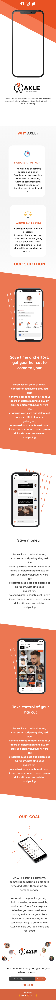

# AXLE

## Overview
Product Landing Page

### Screenshot

### Links

## My process

I started the process of creating the layout design using AdobeXd.
I researched the the design on Dribble for have some inspiration.

After completing the design phase,I've created a profile in mailchimp and used the pkg "Mailchimp-Subscribe".
I've also used another great tool for render the video, "React-Player"

### Built with

- [React](https://reactjs.org/) 
- [Styled Components](https://styled-components.com/) - For style

### Useful resources

Npm Used:

- [React Player](hhttps://www.npmjs.com/package/react-player)
- [Mailchimp-Subscribe](https://www.npmjs.com/package/react-mailchimp-subscribe)

## Author

- Website - [Diego Massarini](https://diego-slicecode.dev/)
- Twitter - [@slicecodediego](https://twitter.com/slicecodediego)